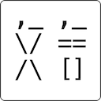

<p align="center">
    
</p>
<h1 align="center">文言 API</h1>
<p align="center">文言文编程语言 HTTP API.</p>

English README: [README.md](./README.md)

# 什么是文言文编程语言？
去这个仓库看看你就懂了: [Wenyan-lang 文言文編程语言](https://github.com/wenyan-lang/wenyan)

# 使用方法

## 克隆仓库
~~~shell
git clone https://github.com/Vincent-the-gamer/wenyan-api.git
~~~

## 安装依赖
~~~shell
pnpm install
~~~

## 运行服务器
~~~shell
pnpm dev
~~~

服务器默认运行在： `http://localhost:8080`。

你可以在 `server.ts` 修改你的ip和端口。

~~~typescript
const host = "0.0.0.0"
const port = 8080
~~~

## 调用API
* URL: `http://localhost:8080`
* Method: `post`
* 请求体: 
    ~~~json
    {
        "code": "吾有一數。曰三。名之曰「甲」。為是「甲」遍。吾有一言。曰「「問天地好在。」」。書之。云云。"
    }
    ~~~

响应:

~~~json
{
	"code": 200,
	"data": "問天地好在。\n問天地好在。\n問天地好在。\n"
}
~~~

`Axios`调用范例:

~~~js
axios.post("http://localhost:8080",{
    code: "吾有一數。曰三。名之曰「甲」。為是「甲」遍。吾有一言。曰「「問天地好在。」」。書之。云云。"
}).then(
    res => {
        console.log(res.data.data)
    }
)
~~~

## 命令行运行代码
将代码写入 `src/main.wy`
```
吾有一數。曰三。名之曰「甲」。
為是「甲」遍。
    吾有一言。曰「「問天地好在。」」。書之。
云云。
```

然后运行

```shell
pnpm wyg run ./src/main.wy
```

# 包管理器: 文渊阁(文淵閣, Wenyan-get)

使用包管理器 `文渊阁`。

**Example:**

* 安装`子曰`
~~~shell
# 使用文渊阁CLI安装ziyue
pnpm wyg i ziyue 

# 或者
pnpm wyg i 子曰
~~~

* 使用子曰
~~~
吾嘗觀「「子曰」」之書。方悟「子曰」之義。 

子曰「「学而时习之，不亦说乎？」」。 
~~~

Result:

~~~
                 __._                                    
                / ___)_                                  
               (_/Y ===\                            __  
               |||.==. =).                            |  
               |((| o |p|      |  学而时习之，不亦说乎？
            _./| \(  /=\ )     |__                     
          /  |@\ ||||||||.                              
         /    \@\ ||||||||\                           
        /   \  \@\ ||||||//\                         
       (     Y  \@\|||| // _\                         
       |    -\   \@\ \\//    \                     
       |     -\__.-./ //\.---.^__                      
       | \    /  |@|__/\_|@|  |  |                     
       \__\      |@||| |||@|     |                     
       <@@@|     |@||| |||@|    /                        
      / ---|     /@||| |||@|   /                         
     |    /|    /@/ || |||@|  /|                         
     |   //|   /@/  ||_|||@| / |                         
     |  // \ ||@|   /|=|||@| | |                        
     \ //   \||@|  / |/|||@| \ |                      
     |//     ||@| /  ,/|||@|   |                         
     //      ||@|/  /|/||/@/   |                         
    //|   ,  ||//  /\|/\/@/  / /                       
   //\   /   \|/  /H\|/H\/  /_/                      
  // |\_/     |__/|H\|/H|\_/                          
 |/  |\        /  |H===H| |                             
     ||\      /|  |H|||H| |                             
     ||______/ |  |H|||H| |                              
      \_/ _/  _/  |L|||J| \_                           
      _/  ___/   ___\__/___ '-._                        
     /__________/===\__/===\---'                       
                                                                                    
~~~

更多文渊阁的相关信息：[https://github.com/wenyan-lang/wyg](https://github.com/wenyan-lang/wyg)